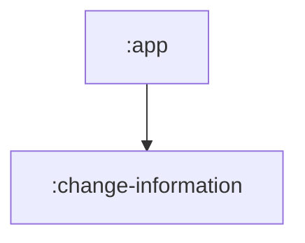

# Android Modulorization Project

This project demonstrates a modular Android application architecture using Jetpack Compose and Gradle Kotlin DSL.

## Project Structure

The project is divided into several modules to ensure separation of concerns and improve build times.

### Core Modules

- **`:app`**: The main application module. It serves as the entry point and orchestrates the different feature modules.
  - **Namespace**: `com.domain.android.modulorization`
  - **Responsibilities**: App initialization (`MyApp.kt`), main UI navigation (`MainScreen.kt`), and dependency integration.

- **`:change-information`**: A feature module focused on managing and displaying "change information".
  - **Namespace**: `com.domain.android.modulorization.feature.change_information`
  - **Type**: Android Library
  - **Responsibilities**: Encapsulates all logic and UI related to the change information feature.

## Tech Stack

- **Language**: Kotlin
- **UI Framework**: Jetpack Compose
- **Build System**: Gradle Kotlin DSL (`.gradle.kts`)
- **Dependency Management**: Gradle Version Catalogs (`libs.versions.toml`)
- **Minimum SDK**: 24
- **Target SDK**: 36
- **Java Version**: 21

## Module Dependencies

- The `:app` module depends on `:change-information` to include its functionality in the final application.

## How to Run

1. Open the project in Android Studio.
2. Sync the project with Gradle files.
3. Select the `app` configuration and click **Run**.

## Key Files

- `settings.gradle.kts`: Defines the project name and included modules.
- `gradle/libs.versions.toml`: Centralized location for dependency versions and definitions.
- `build.gradle.kts` (Root): Project-wide build configurations.
